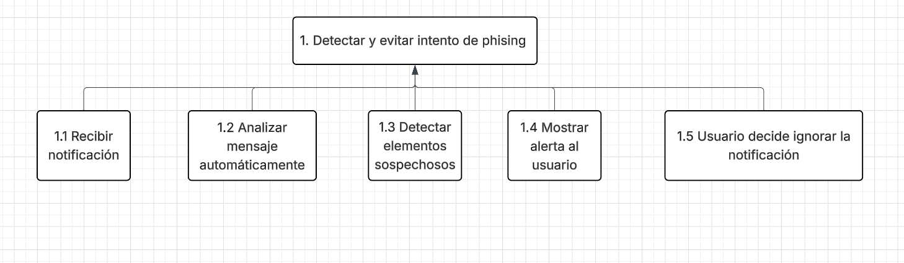
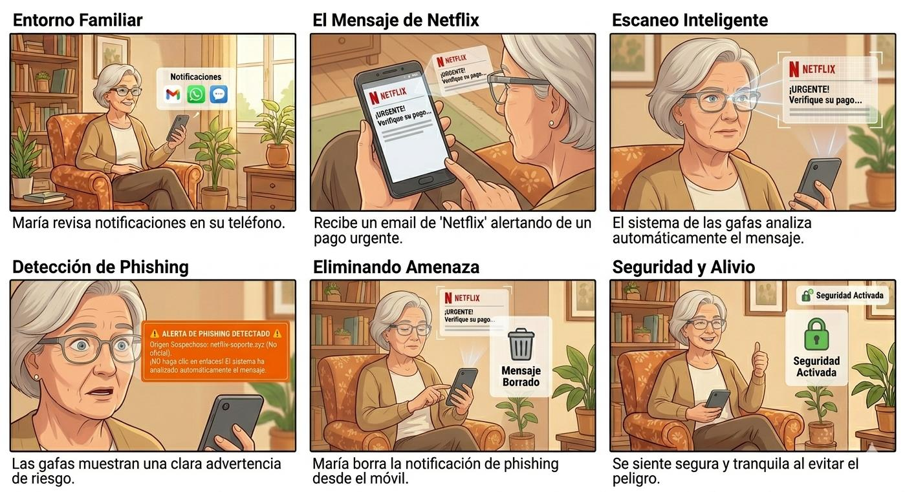
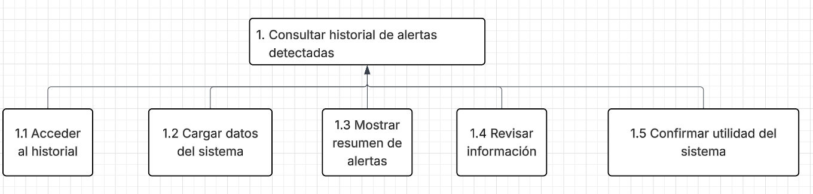
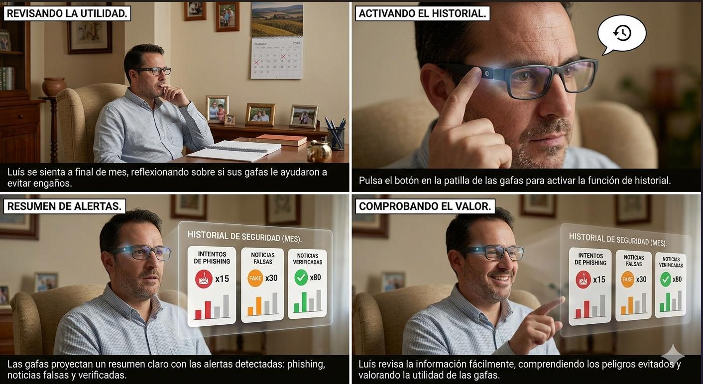
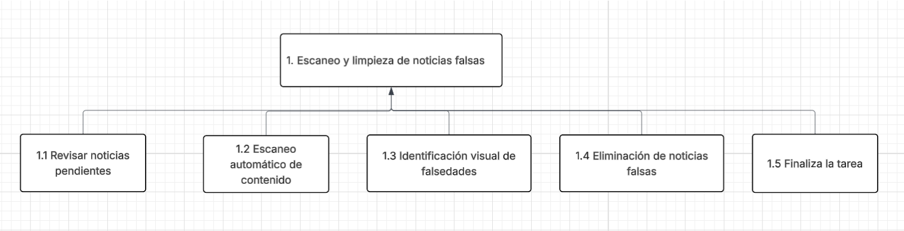
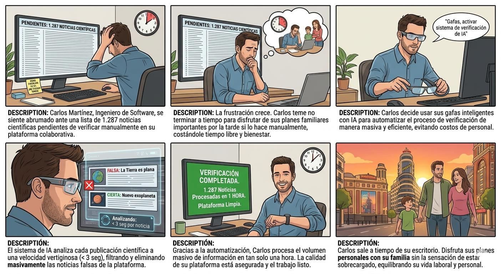

**Práctica4:** **DiseñoCentradoenelUsuario:** **Personas,**
**Escenarios,** **tareas**

**1.Introducción**

> • **Contexto:**Elaumentodeladesinformación(bulos) ylosataquesde
> *phishing*a
> travésdemediosdigitalesafectademaneradesproporcionadaausuarios
> vulnerables,especialmenteapersonasdeedad avanzadao quenoestán
> familiarizadosconentornosdigitales.
>
> • **Objetivos:**Definir elperfildeusuariomediantelacreacióndePersonasy
> Escenarios.
>
> • **Alcance:**Eltrabajo secentraeneldiseño deunsistemabasadoengafas
> inteligentescapazdeanalizar contenidodigitalentiemporealparadetectar
> bulos,desinformaciónyposiblesataquesdephishing.Sedesarrollaránperfiles
> deusuario,escenariosdeusoyunanálisisdetareas,sinabordar la
> implementacióntécnicadelsistema.

**2.Procesoydecisiones** **de** **diseño**

> • **Metodología:** Paraeldesarrollodeestapropuestasehatenidoencuentael
> needfindingquerealizamos,para identificar lasnecesidadesrealesdelos
> usuarios. Apartirdeestainformación,sehadefinidounperfildeusuarioyseha
> elaboradounescenariodeusoquepermitacontextualizar lainteraccióndel
> usuarioconelsistema enunasituaciónreal.
> Finalmente,seharealizadounanálisisdetareasmediantedescomposición
> jerárquica(HTA),conelobjetivodecomprender lasaccionesqueelusuario
> deberealizar ycómoelsistema puedefacilitar dichastareas.
>
> •
> **Análisisdedatos:**Hemosutilizadolainteligenciaartificial,enespecífico
> Kollabe,paralacreacióndeunusuarioqueencajeperfectamentealas
> necesidadesdescritasenelneedfinding.
>
> • **Definicióndelprimerusuario:**
>
> **Nombre:**MaríaGonzález
>
> **Edad**
> **yperfil:**68años.Jubilada(exprofesoradeprimaria).ResideenMadrid.
> Tieneunniveldeconforttecnológicobajo,utilizandoprincipalmenteun móvil
> Androidbásicoyuna Tablet.
>
> **Necesidadesyobjetivos:**Maríabuscamantenerseinformadadeformasegura.
> Legustaríanodepender tantodesushijosparacomprobar siunanoticiaes
> verdaderaofalsa.
>
> **Frustraciones:**Lecuestamuchodistinguir laveracidad
> deunanoticiaysobre
> todoloscorreosengañosos,ademássesienteincómodaconinterfaces
> complejasytemequelatecnología cadavez sevuelvamásdifícildeusar.
>
> • **Definicióndelsegundousuario**
>
> **Nombre:**LuísHernández
>
> **Edad** **yperfil:45**años.Dueñodeunaferretería.Resideen
> Sevilla.Noestámuy familiarizadoconlatecnologíaylecuestamuchodistinguir
> noticiasfalsasde verdaderas.
>
> **Necesidadesyobjetivos:**Legustaríanotener tantosproblemasypoder
> navegar sinelmiedoaqueleengañenconstantementeyevitar asílanecesidad
> detener querecurrir siemprea suhijoparapodercontrarrestar
> lainformación.
>
> **Frustraciones:**Sienteunagrandificultadparareconocer
> noticiasfalsasensu móvilypor
> tantodesconfíadeabsolutamentetodaslasnoticiasque aparecen
> enmediosdigitales,ademásvariasveceshaceelridículopor contarleasus
> amigosnoticiasqueeranfalsasyqueélhabíatomadopor ciertas.
>
> • **Definicióndeltercerusuario**
>
> **Nombre:**CarlosMartínez
>
> **Edad** **yperfil:**42años.IngenierodeSoftware.Resideen Madrid
> ytrabajade
> maneraonline.Tieneunniveldeconforttecnológicoalto.Hadesarrolladouna
> plataformadenoticiascolaborativassobreciencia,dondecualquier usuario
> puedesubir noticiasrelacionadasyescribirsuopinión.
>
> **Necesidadesyobjetivos:**Necesitaautomatizar
> elprocesodeverificaciónde
> noticias,paraquesuplataformanotenganingunasolanoticiafalsa,pero
>
> contratar aunequipoqueesteconstantementeverificando sesalede
> presupuesto.
>
> **Frustraciones:**Lefrustralagrancantidad detiempoque pierdeen el
> mantenimientodesuaplicación,sobretodoenelapartadodeverificaciónde
> noticias,muchasvecespierdetiempolibrepor esto.
>
> • **Escenariodeuso**
>
> Maríaseencuentraenelsalóndesucasarevisandosusnotificacionesatravés
> desusgafasinteligentes.Enesemomento,recibeunemailaparentemente
> enviadopor Netflixenelqueseinformadeunproblemaconsupagoy sele
> solicitavalidar susdatosdeformaurgente.
>
> Sinnecesidad algunadeiterar porsuparte,elsistemaanalizaautomáticamente
> elcontenidodelmensajeyenpocossegundos,lasgafassoncapacesde detectar
> unposibleintentode phishingymuestraunaadvertenciaclara
> indicandoelriesgo.
>
> Maríacomprendequeelmensajepuedeser peligrosoynoentraaningúnenlace
> nirealizainteracciónalgunaconelemail,simplementeloborra.
>
> **Análisisdetareas(HTA)**
>
> **1.** **Recibirnotificación**
>
> 1.1. Maríaprestaatenciónalanotificación
>
> **2.** **Análisisdelsistema**
>
> 2.1. Escaneoautomáticodelcontenido
>
> 2.2. Identificacióndeelementossospechosos
>
> 2.3.Clasificacióncomophishing
>
> **3.** **Comunicaciónalusuario**
>
> 3.1.Mostrar alerta
>
> 3.2. Interpretaciónpor partedelusuario

> **4.** **Accióndelusuario**
>
> 4.1. Ignorar mensaje
>
> **Storyboard:**
>
> • **Otroposibleescenariodeuso**
>
> Luisseencuentraensucasaafinaldemesrevisandoelusoquehahechode
> susgafasinteligentes,paracomprobarsideverdad lehansidodeutilidad,
> quiererecordar lacantidad denoticiasfalsasointentosdephishingqueevito
> graciasaestasgafas.
>
> Paraelloactivalafuncióndehistorialmedianteelbotónubicadoenlapatillade
> lasgafas.Automáticamente,elsistemaproyectaunresumenclarodelas
> alertasdetectadas,mostrandolosintentosde phishing,noticiasfalsasy
> noticiasverificadas.
>
> Luísrevisalainformacióndeformasencilla,comprendiendoquésituaciones
> hansidopeligrosasycomprobandolautilidad delasgafas.
>
> **Análisisdetareas(HTA)**
>
> **1.** **Accesoalhistorial**
>
> 1.1.Luispulsaelbotóndeacceder alhistorial
>
> **2.** **Activacióndelsistema**
>
> 2.1.Elsistemareconocelaacción
>
> 2.2.Cargaelhistorialdealertas
>
> **3.** **Visualizacióndelainformación**
>
> 3.1.Mostrar resumendealertas
>
> 3.2.Clasificar información(phishing,noticiasfalsasetc)
>
> 3.3.Presentarcontenidodeformaclara
>
> **4.** **Interpretacióndelusuario**
>
> 4.1.Maríarevisalasalertas
>
> 4.2. Comprendelosriesgosdetectados
>
> **5.** **Cierredelatarea**
>
> 5.1.Luísfinalizalaconsulta

> **Storyboard:**
>
> • **Últimoescenariodeuso**
>
> Carlosseencuentraensuescritoriofrenteaunalistade 1.287noticias
> científicaspendientesdeverificar.Tieneplanesimportantesconsufamiliapor
> latardeysientelapresióndenopoder terminar atiempomanualmente.
>
> Activasusgafasinteligentesyel sistemaanalizacadapublicaciónenmenosde
> 3segundosGraciasaesto,Carlosprocesaelvolumenmasivodeinformación
> entansolounahora,filtrandoyeliminandolasnoticiasfalsasdeformamasiva.
> Así,lograasegurar lacalidad delaplataformaysalir
> atiempoparadisfrutarde susplanespersonalessinlasensacióndeestar
> sobrecargado.
>
> **Análisisdetareas(HTA)**
>
> **1.** **Iniciodelatarea**
>
> 1.1.Carlosrevisaelvolumendenoticiaspendientes(1287).
>
> 1.2. Evalúa eltiempodisponibleantesdesucompromisopersonal.
>
> **2.** **Escaneodelcontenido**
>
> 2.1.Escaneoautomáticodecadanoticia.

> **3.** **Comunicaciónalusuario**
>
> 3.1.Lasgafasmuestranquenoticiassonfalsas
>
> **4.** **Accióndelusuario**
>
> 4.1.Carloseliminalasnoticiasfalsas
>
> **5.** **Cierredelatarea**
>
> 5.1.Carlossequitalasgafasydisponedetiempoparasucompromiso personal
>
>  style="width:6.26042in;height:3.42708in" />**Storyboard:**
>
> • **Justificación:**Estafasedelprocesodediseñocentradoenelusuarioes
> fundamental,yaquepermitetrasladarlainformaciónqueobtuvimosenel
> needfindingarepresentacionesmásestructuradas yútilesparaeldiseño.
>
> LadefinicióndePersonasnospermiteponernosenlapieldelusuario
> mejorandolatomadedecisionesparamantener elfocoensusnecesidades.
>
> • **Aplicacióndeprincipios:**
>
> Noshemosbasadoenlosprincipiosdeldiseñocentradoenelusuario,
> priorizandolacomprensióndelasnecesidadesrealesdelosusuariosapartir de
> lainformaciónylosinformesrealizadosenfasesprevias.
>
> También,hemostenidoencuentalosrequisitoshumanos,considerandolas
> capacidadesylimitacionesdelosusuariosparaadaptar eldiseñoasus
> características.
>
> Sehaaplicadoelanálisisdetareas,descomponiendolasaccionesnecesarias,
> talycomoseestableceenelprocesode diseñodesistemasinteractivos.
>
> Por último,sehaseguidounenfoqueorientadoalausabilidad,conelobjetivo
> dequeelsistemapermitaalusuariocumplirsusobjetivosdeformaeficaz y
> comprensible.

**4.Conclusiones**

> • **Valoracióntécnica:** Hemosconseguidocrear escenariosquesepueden
> ajustar asituacionesrealesenlosquelasgafasinteligentesseandegran
> utilidad,sobretodoparapersonasmayores,queeselejemploquehemos
> planteado.
>
> • **Leccionesaprendidas:**Pensar
> endiferentesescenariosnoshapermitidollevar
> lavisiónqeutenemosdenuestrainterfazhaciaunplanomásrealista yloútil
> quéseríaparalasociedaduninventoasí.

**5.** **Siguientes** **pasos** **en** **el** **proceso** **DCU**

Lasiguienteetapaseríaprobarconperfilesdeusuariosreales,noconusuarios
imaginariosgeneradosconinteligenciaartificial,deestamanerasepodríanestudiar
escenariosmuchomásrealistasypodríamosobtener unaopiniónsincerayotros
detallesimportantesparamejorar nuestrosistema.

**6.** **División** **del** **trabajo** **(para** **grupos/parejas)**

Losdosnoshemosayudadoenrealizartodoelinformedeformaconjunta,exceptoen
elplanteamientodelosescenariosyelanálisisdetareasdeambos,mientrasque
Walid realizóeldelprimer escenario,Danielseencargódelsegundo.

**7.** **Declaración** **sobre** **el** **uso** **de** **Inteligencia**
**Artificial**

HemosutilizadoKollabeparadefinir
unusuariorealqueseajustasealasnecesidades encontradasenelneedfinding,
ChatGPTparamejorar laestructuradela redacción
ademásdeconsultarlesinuestrosescenarioseranadecuadosparalapráctica y
GeminiparalageneracióndelosStoryBoards
